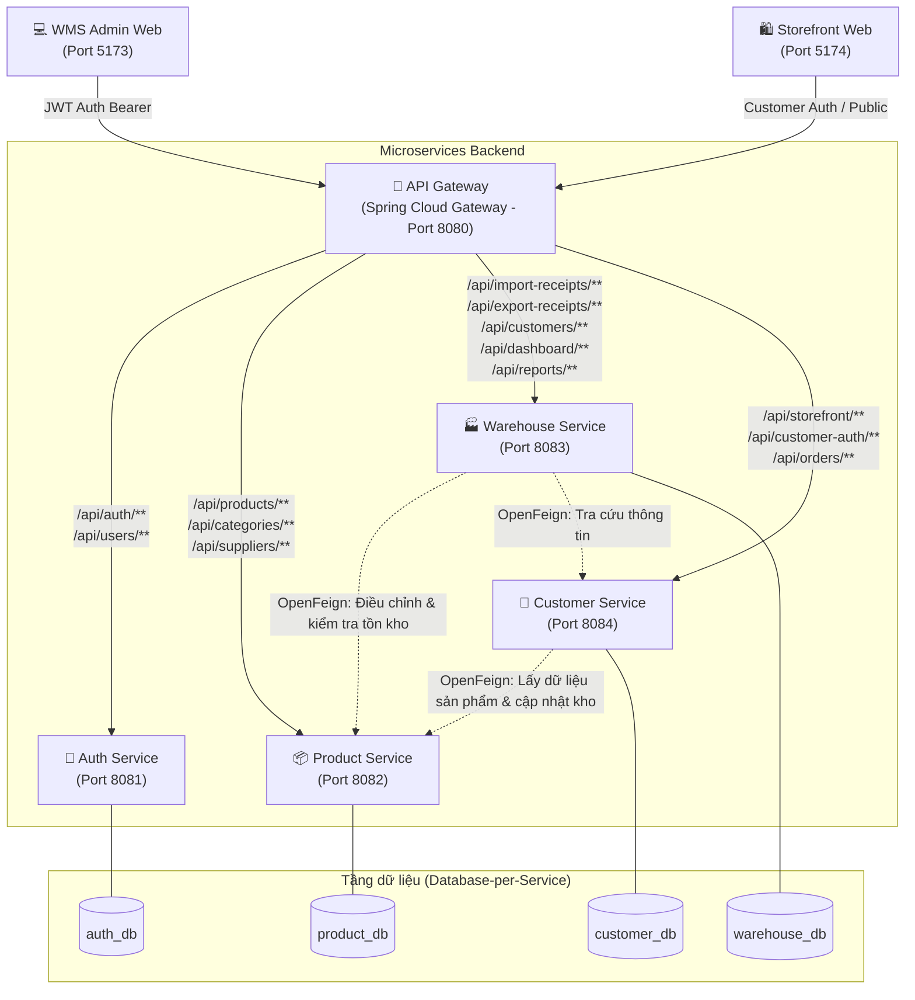

# 🏢 HỆ THỐNG QUẢN LÝ KHO HÀNG (WMS) & CỬA HÀNG STOREFRONT VELVETY

[](#-kiến-trúc-hệ-thống)
[](https://spring.io/projects/spring-boot)
[](https://react.dev/)
[](https://www.mysql.com/)

> **WMS Microservices & Storefront Velvety** là hệ thống quản lý kho hàng doanh nghiệp kết hợp cổng bán lẻ trực tuyến (E-commerce Storefront) được xây dựng theo kiến trúc Microservices hiện đại, tuân thủ nguyên tắc **Database-per-Service** và giao tiếp liên dịch vụ đồng bộ an toàn qua **Spring Cloud OpenFeign**.

---

## 📌 Mục lục

1. [Kiến trúc hệ thống](#-kiến-trúc-hệ-thống)
2. [Danh mục Microservices & Cổng kết nối](#-danh-mục-microservices--cổng-kết-nối)
3. [Giao diện người dùng (Frontends)](#-giao-diện-người-dùng-frontends)
4. [Tài khoản đăng nhập mặc định](#-tài-khoản-đăng-nhập-mặc-định)
5. [Nguyên tắc dữ liệu & Giao tiếp liên dịch vụ](#-nguyên-tắc-dữ-liệu--giao-tiếp-liên-dịch-vụ)
6. [Cấu trúc thư mục dự án](#-cấu-trúc-thư-mục-dự-án)
7. [Yêu cầu môi trường](#-yêu-cầu-môi-trường)
8. [Hướng dẫn cài đặt & Khởi chạy](#-hướng-dẫn-cài-đặt--khởi-chạy)
9. [Bảng định tuyến API Gateway](#-bảng-định-tuyến-api-gateway)
10. [Tài liệu tham khảo](#-tài-liệu-tham-khảo)

---

## 🏗 Kiến trúc hệ thống

Hệ thống sử dụng **Spring Cloud Gateway** làm cổng tiếp nhận duy nhất cho cả hệ thống quản trị kho và cổng bán hàng trực tuyến:



---

## 🧩 Danh mục Microservices & Cổng kết nối

| Service | Port | Database | Công nghệ | Trách nhiệm chính |
| :--- | :---: | :--- | :--- | :--- |
| **`api-gateway`** | **8080** | *(Không dùng)* | Spring Cloud Gateway (WebFlux) | Single Entry Point, định tuyến request, xử lý CORS tập trung, kiểm tra JWT Header & Partner API Key. |
| **`auth-service`** | **8081** | `auth_db` | Spring Boot, Spring Security, JWT | Quản lý người dùng nội bộ (`users`), phân quyền 3 vai trò (`ADMIN`, `MANAGER`, `STAFF`), sinh và xác thực JWT token. |
| **`product-service`** | **8082** | `product_db` | Spring Boot, Spring Data JPA | Quản lý Danh mục (`categories`), Nhà cung cấp (`suppliers`), Sản phẩm (`products`), điều chỉnh số lượng tồn kho và chặn xuất âm kho. |
| **`warehouse-service`** | **8083** | `warehouse_db` | Spring Boot, JPA, OpenFeign | Quản lý Khách hàng đại lý (`customers`), Phiếu nhập kho, Phiếu xuất kho, Thống kê Dashboard KPI, Báo cáo tồn kho & xuất nhập tồn. |
| **`customer-service`** | **8084** | `customer_db` | Spring Boot, JPA, OpenFeign | Phục vụ khách lẻ B2C Storefront: Đăng ký/đăng nhập khách hàng, danh mục/sản phẩm công khai, tạo và tra cứu đơn hàng (`orders`). |

---

## 🖥 Giao diện người dùng (Frontends)

| Frontend | Port | URL truy cập | Công nghệ | Mô tả chức năng |
| :--- | :---: | :--- | :--- | :--- |
| **WMS Admin** (`crs-frontend`) | **5173** | `http://localhost:5173` | React 19, Vite, TypeScript, Lucide React, React Router 7 | Hệ thống quản trị kho nội bộ: Dashboard KPI, quản lý xuất - nhập kho, theo dõi tồn kho, quản lý danh mục, nhà cung cấp, đối tác, tài khoản. |
| **Storefront** (`storefront-frontend`) | **5174** | `http://localhost:5174` | React 19, Vite, TypeScript, TailwindCSS 3, Axios | Cổng mua sắm trực tuyến dành cho khách hàng: Xem danh mục, tìm kiếm sản phẩm mỹ phẩm Velvety, thêm vào giỏ hàng và đặt đơn hàng. |

---

## 🔑 Tài khoản đăng nhập mặc định (WMS Admin)

| Vai trò (Role) | Username | Password | Quyền hạn chính |
| :--- | :--- | :--- | :--- |
| **ADMIN** | `admin` | `admin123` | Toàn quyền hệ thống: Quản lý User, cấu hình, xuất/nhập kho, huỷ phiếu, xem báo cáo & Dashboard. |
| **MANAGER** | `manager` | `manager123` | Quản lý nghiệp vụ kho: Tạo & huỷ phiếu nhập/xuất, thêm/sửa sản phẩm, nhà cung cấp, xem báo cáo & Dashboard. |
| **STAFF** | `staff` | `staff123` | Nhân viên kho: Xem dữ liệu, lập phiếu nhập kho và lập phiếu xuất kho. |

---

## 🔒 Nguyên tắc dữ liệu & Giao tiếp liên dịch vụ

1. **Database-per-Service**:
   - Mỗi service sở hữu hoàn toàn cơ sở dữ liệu riêng, độc lập tuyệt đối. Không một service nào được truy vấn chéo vào DB của service khác.
   - Bảng chi tiết phiếu xuất/nhập trong `warehouse_db` lưu snapshot thông tin sản phẩm (`product_id`, `product_code`, `product_name`, `unit`) nhằm đảm bảo tính toàn vẹn dữ liệu lịch sử ngay cả khi sản phẩm gốc có sự thay đổi.
2. **Giao tiếp liên dịch vụ (Inter-Service Communication)**:
   - Sử dụng **Spring Cloud OpenFeign** giao tiếp đồng bộ.
   - Khi tạo **Phiếu nhập kho**: `warehouse-service` gọi `product-service` (`POST /products/{id}/adjust-stock?delta=+qty`) để tăng tồn kho.
   - Khi tạo **Phiếu xuất kho**: `warehouse-service` gọi `product-service` (`POST /products/{id}/adjust-stock?delta=-qty`) để kiểm tra số lượng và trừ tồn kho. Nếu không đủ hàng tồn, hệ thống sẽ ném ngoại lệ và huỷ giao dịch để **chặn xuất âm kho**.
   - Khi huỷ phiếu: Cơ chế rollback tự động hoàn tác số lượng tồn kho tương ứng.
3. **Bảo mật**:
   - `FeignRequestInterceptor` tự động forward header `Authorization: Bearer <token>` giữa các microservices.
   - Kết nối nội bộ giữa các service hỗ trợ xác thực qua Partner Secret Key (`wms-partner-key-2026`).

---

## 📁 Cấu trúc thư mục dự án

```text
crs-microservices/
├── api-gateway/              # Spring Cloud Gateway (Port 8080)
├── auth-service/             # Quản lý tài khoản & JWT (Port 8081)
├── product-service/          # Quản lý sản phẩm, danh mục, tồn kho (Port 8082)
├── warehouse-service/        # Quản lý xuất/nhập kho, báo cáo, dashboard (Port 8083)
├── customer-service/         # Dịch vụ khách hàng B2C & Storefront (Port 8084)
├── crs-frontend/             # Ứng dụng WMS Admin Portal React (Port 5173)
├── storefront-frontend/      # Ứng dụng B2C Storefront React (Port 5174)
├── docs/                     # Tài liệu thiết kế hệ thống & Blueprint API
│   ├── blueprint-api.md
│   └── thiet-ke-bien-gioi-service.md
├── start-all.bat             # Script tự động khởi động toàn bộ 7 dịch vụ với Menu điều khiển
├── stop-all.bat              # Script dừng nhanh tất cả các dịch vụ
└── README.md                 # Tài liệu hướng dẫn dự án
```

---

## ⚙️ Yêu cầu môi trường

- **Java Development Kit (JDK)**: Java 17 hoặc Java 21+
- **Node.js**: v18.x trở lên & **npm**
- **Cơ sở dữ liệu**: MySQL 8.x (Port mặc định trong cấu hình: `3336` hoặc chỉnh về `3306` tùy môi trường máy bạn)
- **Maven**: Đã tích hợp sẵn Maven Wrapper (`mvnw.cmd`) trong mỗi service.

---

## 🚀 Hướng dẫn cài đặt & Khởi chạy

### 1. Chuẩn bị cơ sở dữ liệu MySQL

Khởi động MySQL và tạo 4 database độc lập:

```sql
CREATE DATABASE IF NOT EXISTS auth_db CHARACTER SET utf8mb4 COLLATE utf8mb4_unicode_ci;
CREATE DATABASE IF NOT EXISTS product_db CHARACTER SET utf8mb4 COLLATE utf8mb4_unicode_ci;
CREATE DATABASE IF NOT EXISTS warehouse_db CHARACTER SET utf8mb4 COLLATE utf8mb4_unicode_ci;
CREATE DATABASE IF NOT EXISTS customer_db CHARACTER SET utf8mb4 COLLATE utf8mb4_unicode_ci;
```

> **Lưu ý cấu hình kết nối**: Kiểm tra lại thông tin `username`, `password` và `port` trong các file `application.properties` của 4 services (`auth-service`, `product-service`, `warehouse-service`, `customer-service`):
> ```properties
> spring.datasource.url=jdbc:mysql://localhost:3336/<ten_database>?useSSL=false&allowPublicKeyRetrieval=true&serverTimezone=Asia/Ho_Chi_Minh
> spring.datasource.username=root
> spring.datasource.password=12345
> ```

---

### 2. Khởi chạy nhanh toàn bộ hệ thống bằng Script (Khuyên dùng trên Windows)

Chạy file batch tại thư mục gốc:

```cmd
.\start-all.bat
```

Script sẽ tự động:
1. Kiểm tra trạng thái cổng của từng dịch vụ.
2. Khởi động lần lượt 5 Spring Boot microservices và 2 ứng dụng React Frontend.
3. Mở menu điều khiển tương tác trực quan cho phép bạn Bật / Tắt riêng lẻ từng dịch vụ khi cần gỡ lỗi hoặc bảo trì.

Để dừng toàn bộ hệ thống:
```cmd
.\stop-all.bat
```
*(Hoặc gõ `stop-all.bat` từ Command Prompt)*

---

### 3. Khởi chạy thủ công từng dịch vụ (Tùy chọn)

Nếu muốn khởi chạy và quan sát log riêng của từng thành phần:

#### Bước 3.1: Khởi chạy Microservices Backend (mỗi service mở 1 terminal riêng)

```bash
# Terminal 1: Auth Service (Port 8081)
cd auth-service && .\mvnw.cmd spring-boot:run

# Terminal 2: Product Service (Port 8082)
cd product-service && .\mvnw.cmd spring-boot:run

# Terminal 3: Warehouse Service (Port 8083)
cd warehouse-service && .\mvnw.cmd spring-boot:run

# Terminal 4: Customer Service (Port 8084)
cd customer-service && .\mvnw.cmd spring-boot:run

# Terminal 5: API Gateway (Port 8080)
cd api-gateway && .\mvnw.cmd spring-boot:run
```

#### Bước 3.2: Khởi chạy Frontends

```bash
# Terminal 6: WMS Admin Frontend (Port 5173)
cd crs-frontend
npm install
npm run dev

# Terminal 7: Storefront Frontend (Port 5174)
cd storefront-frontend
npm install
npm run dev
```

---

## 🗺️ Bảng định tuyến API Gateway

Mọi yêu cầu từ Client gửi đến Gateway qua tiền tố `/api/...` (Port `8080`):

| Route Gateway | Dịch vụ đích | Quyền hạn |
| :--- | :--- | :--- |
| `/api/auth/**` | `http://localhost:8081/auth/**` | Public cho login, yêu cầu JWT cho các thao tác khác |
| `/api/users/**` | `http://localhost:8081/users/**` | Yêu cầu JWT (Role ADMIN) |
| `/api/categories/**` | `http://localhost:8082/categories/**` | Xem: ALL; Thêm/Sửa/Xoá: ADMIN, MANAGER |
| `/api/products/**` | `http://localhost:8082/products/**` | Xem: ALL; Thêm/Sửa/Xoá: ADMIN, MANAGER |
| `/api/suppliers/**` | `http://localhost:8082/suppliers/**` | Xem: ALL; Thêm/Sửa/Xoá: ADMIN, MANAGER |
| `/api/suppliers/*/receipts` | `http://localhost:8083/suppliers/*/receipts` | Xem lịch sử phiếu nhập theo NCC |
| `/api/customers/**` | `http://localhost:8083/customers/**` | Xem: ALL; Thêm/Sửa/Xoá: ADMIN, MANAGER |
| `/api/import-receipts/**` | `http://localhost:8083/import-receipts/**` | Xem & Lập phiếu: ALL; Huỷ: ADMIN, MANAGER |
| `/api/export-receipts/**` | `http://localhost:8083/export-receipts/**` | Xem & Lập phiếu: ALL; Huỷ: ADMIN, MANAGER |
| `/api/dashboard/**` | `http://localhost:8083/dashboard/**` | ADMIN, MANAGER, STAFF |
| `/api/reports/**` | `http://localhost:8083/reports/**` | ADMIN, MANAGER |
| `/api/storefront/**` | `http://localhost:8084/storefront/**` | Public (Xem danh mục, sản phẩm cho khách lẻ) |
| `/api/customer-auth/**` | `http://localhost:8084/customer-auth/**` | Public (Đăng ký, đăng nhập tài khoản khách lẻ) |
| `/api/orders/**` | `http://localhost:8084/orders/**` | Yêu cầu Token khách hàng B2C |

---

## 📖 Tài liệu tham khảo

- Chi tiết các endpoint API: Xem tại [docs/blueprint-api.md](file:///d:/crs-microservices/docs/blueprint-api.md)
- Thiết kế phân chia biên giới dịch vụ: Xem tại [docs/thiet-ke-bien-gioi-service.md](file:///d:/crs-microservices/docs/thiet-ke-bien-gioi-service.md)
