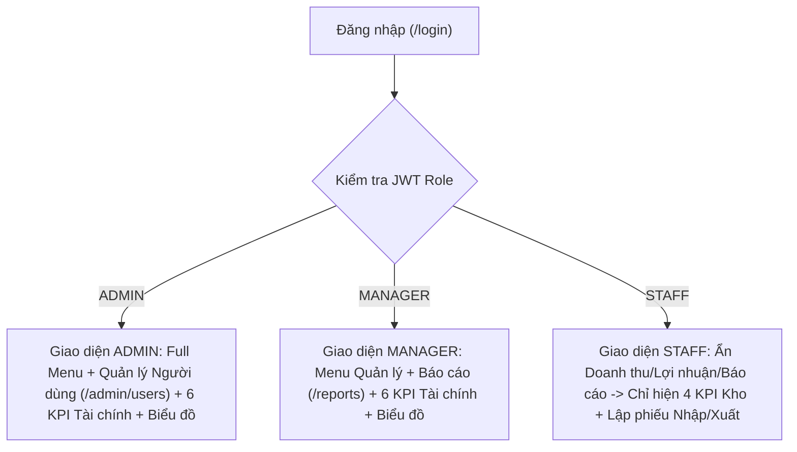

# Tài Liệu Thiết Kế Giao Diện & Wireframe Mockup Dự Án
*(Hệ thống Quản lý Kho hàng WMS Microservices & Cửa hàng Trực tuyến VELVETY)*

---

## 1. Hệ Thống Thiết Kế (Design System Specification)

Dự án áp dụng **Thiết kế Đa Giao diện (Multi-Portal Design System)** tách biệt rõ bảng màu và kiểu chữ giữa **Hệ thống Quản trị Nội bộ (WMS Admin)** và **Cửa hàng Khách hàng (Storefront B2C)**:

| Tiêu chí | Giao diện Quản trị Kho (`crs-frontend`) | Giao diện Khách hàng (`storefront-frontend`) |
| :--- | :--- | :--- |
| **Phong cách chủ đạo** | **Enterprise SaaS Dashboard** — Tối ưu mật độ dữ liệu, bảng biểu, biểu đồ và phiếu in A4 | **Editorial E-Commerce (VELVETY)** — Tối giản, sang trọng, cảm hứng thiên nhiên hữu cơ |
| **Màu nền chính (Background)** | Xám sáng công nghiệp `#F8FAFC` / Thẻ trắng `#FFFFFF` | Trắng ngọc trai (`pearl`) `#F8F9F5` / Xanh bạc hà nhạt (`mint-card`) `#EBF0EA` |
| **Màu nhấn (Primary Accent)** | Xanh dương chuẩn ERP `#2563EB` (`--accent`) | Xanh Olive đậm (`olive-600`) `#263E2B` & `#19281C` |
| **Màu trạng thái (Semantic)** | Xanh lá `#10B981` (Doanh thu/Hoàn thành), Tím `#6366F1` (Lợi nhuận), Đỏ `#EF4444` (Cảnh báo tồn kho) | Vàng hổ phách `#FEF3C7` / `#92400E` (`BEST SELLER`), Cam `#D97706` (Sắp hết hàng `< 10`) |
| **Bộ phông chữ (Typography)** | `Inter`, `system-ui`, `sans-serif` (Rõ nét cho số liệu kế toán) | Tiêu đề: `Playfair Display` (Serif) + Nội dung: `Plus Jakarta Sans` (Sans-serif) |
| **Bố cục lưới (Grid System)** | Lưới KPI `3x2` (`stat-grid-3x2`), Lưới Biểu đồ `2fr 1fr`, Bảng dữ liệu cuộn ngang | Lưới sản phẩm 4 cột (`grid-cols-1 sm:grid-cols-2 lg:grid-cols-4 gap-6`), Ngăn kéo trượt (`CartDrawer`) |

---

## 2. Wireframe Mockup — Trang Quản Trị Kho (`DashboardPage.tsx`)

### 2.1. Bố cục khung màn hình (Layout Wireframe)
```text
+--------------------------------------------------------------------------------------------------+
| [Logo] QUẢN LÝ KHO HÀNG | Tổng quan | Sản phẩm | Nhập kho | Xuất kho | Đơn hàng | Báo cáo | Admin|
+--------------------------------------------------------------------------------------------------+
| TỔNG QUAN KHO HÀNG                                    [Báo cáo doanh thu] [+Phiếu nhập] [+Phiếu xuất]
| Xin chào Quản trị viên, hệ thống đang hoạt động ổn định.                                         |
+--------------------------------------------------------------------------------------------------+
| +-----------------------------+  +-----------------------------+  +----------------------------+ |
| | DOANH THU THÁNG NÀY    [↗] |  | LỢI NHUẬN GỘP ƯỚC TÍNH  [$] |  | TỔNG GIÁ TRỊ TỒN KHO   [$] | |
| | 45.800.000 ₫               |  | +12.450.000 ₫               |  | 890.500.000 ₫              | |
| | Hôm nay: 3.200.000 ₫       |  | Tỷ suất LN: [ 27.2% ]       |  | Quy mô: 15 sản phẩm        | |
| +-----------------------------+  +-----------------------------+  +----------------------------+ |
| +-----------------------------+  +-----------------------------+  +----------------------------+ |
| | XUẤT KHO THÁNG NÀY     [↑] |  | NHẬP KHO THÁNG NÀY      [↓] |  | CẢNH BÁO SẮP HẾT HÀNG  [!] | |
| | 12 phiếu xuất              |  | 8 phiếu nhập                |  | 2 mặt hàng                 | |
| | Trạng thái: [Đã hoàn thành]|  | Trị giá: 145.000.000 ₫      |  | Mức tồn: [Cần bổ sung ngay]| |
| +-----------------------------+  +-----------------------------+  +----------------------------+ |
+--------------------------------------------------------------------------------------------------+
| +-------------------------------------------------------------+  +----------------------------+ |
| | BIỂU ĐỒ 6 THÁNG GẦN NHẤT   [Doanh thu & LN | Nhập vs Xuất]  |  | TOP SẢN PHẨM BÁN CHẠY      | |
| |                                                             |  |                            | |
| |   ||      ||      ||      ||      ||      ||                |  | #1 Laptop Dell Inspiron 15 | |
| |   || ||   || ||   || ||   || ||   || ||   || ||             |  |    [15 đã bán] 225.000.000₫| |
| |  Th.05   Th.06   Th.07   Th.08   Th.09   Th.10              |  | #2 CHICORI Essence 50ml    | |
| |  [■ Doanh thu] [■ Lợi nhuận]                                |  |    [12 đã bán]   5.880.000₫| |
| +-------------------------------------------------------------+  +----------------------------+ |
+--------------------------------------------------------------------------------------------------+
| +----------------------------------------------------------------------------------------------+ |
| | [!] CẢNH BÁO SẢN PHẨM SẮP HẾT HÀNG (Tồn kho <= Ngưỡng tối thiểu)            [+ Nhập hàng ngay]| |
| | Mã SP | Tên sản phẩm                    | Danh mục       | ĐVT   | Tồn | Tối thiểu | Trạng thái| |
| | SP004 | Nồi chiên không dầu Sunhouse 6L | Đồ gia dụng    | Cái   |  6  |    10     | [Sắp hết] | |
| | SP006 | Giấy in Double A A4 70gsm       | Văn phòng phẩm | Thùng |  4  |    15     | [Sắp hết] | |
| +----------------------------------------------------------------------------------------------+ |
+--------------------------------------------------------------------------------------------------+
```

### 2.2. Luồng thích ứng giao diện theo vai trò (Role-Based UI Flow)


---

## 3. Wireframe Mockup — Trang Báo Cáo & Thống Kê (`ReportsPage.tsx`)

```text
+--------------------------------------------------------------------------------------------------+
| BÁO CÁO & THỐNG KÊ KHO HÀNG                                    [Xuất file Excel (.csv)] [In A4] |
+--------------------------------------------------------------------------------------------------+
| (1) Báo cáo Tồn Kho Hiện Tại  |  (2) Báo cáo Nhập - Xuất - Tồn  |  [(3) Báo cáo Doanh Thu & LN]  |
+--------------------------------------------------------------------------------------------------+
| Khoảng thời gian: [Hôm nay] [7 ngày] [Tháng này] [Quý này] [Năm nay] | Từ: [2026-09-01] Đến:[...] |
+--------------------------------------------------------------------------------------------------+
| +----------------------+ +----------------------+ +----------------------+ +-------------------+ |
| | TỔNG DOANH THU       | | TỔNG GIÁ VỐN (COGS)  | | LỢI NHUẬN GỘP        | | SẢN LƯỢNG ĐƠN XUẤT| |
| | 185.400.000 ₫        | | 142.100.000 ₫        | | +43.300.000 ₫ (23.3%)| | 68 SP / 14 Phiếu  | |
| +----------------------+ +----------------------+ +----------------------+ +-------------------+ |
+--------------------------------------------------------------------------------------------------+
| Chế độ xem chi tiết:  [■ Theo Mặt Hàng / Sản Phẩm]  [□ Theo Phiếu Xuất Kho]  [□ Theo Khách Hàng] |
+--------------------------------------------------------------------------------------------------+
| STT | Mã SP | Tên sản phẩm            | ĐVT   | SL Bán | Giá Bán TB | Doanh Thu  | Lợi Nhuận | % |
|-----+-------+-------------------------+-------+--------+------------+------------+-----------+---|
|  1  | SP001 | Laptop Dell Inspiron 15 | Chiếc |   10   | 15.000.000 |150.000.000 |25.000.000 |17%|
|  2  | VEL01 | CHICORI Essence 50ml    | Chai  |   25   |    490.000 | 12.250.000 | 5.250.000 |43%|
|-----+-------+-------------------------+-------+--------+------------+------------+-----------+---|
| TỔNG CỘNG:                                        68                |185.400.000 |43.300.000 |23%|
+--------------------------------------------------------------------------------------------------+
```

---

## 4. Wireframe Mockup — Trang Cửa Hàng Khách Hàng (`storefront-frontend`)

### 4.1. Bố cục trang chủ & danh sách sản phẩm (`App.tsx`)
```text
+--------------------------------------------------------------------------------------------------+
| VELVETY                        [ 🔍 Tìm kiếm tên hoặc mã SP... ]      [Đơn hàng] [Tài khoản] [🛒]|
+--------------------------------------------------------------------------------------------------+
| +----------------------------------------------------------------------------------------------+ |
| |  🌿 VELVETY BOTANICAL & TECH STOREFRONT                                                      | |
| |  "Chăm sóc toàn diện & Thiết bị chính hãng — Đồng bộ tồn kho thời gian thực"                 | |
| |  [ Khám phá cửa hàng ↓ ]                                                                     | |
| +----------------------------------------------------------------------------------------------+ |
|                                                                                                  |
| Danh mục: (● Tất cả) (○ Thiết bị điện tử) (○ Đồ gia dụng) (○ Mỹ phẩm VELVETY) | Giá | Sắp xếp ▾ |
|                                                                                                  |
| +----------------------+ +----------------------+ +----------------------+ +-------------------+ |
| | [Điện tử] [BEST SELL]| | [Điện tử] [BEST SELL]| | [Điện tử]            | | [Đồ gia dụng]     | |
| | +------------------+ | | +------------------+ | | +------------------+ | | +---------------+ | |
| | |   ( Ảnh SP )     | | | |   ( Ảnh SP )     | | | |   ( Ảnh SP )     | | | |  ( Ảnh SP )   | | |
| | +------------------+ | | +------------------+ | | +------------------+ | | +---------------+ | |
| | LAPTOP DELL INSPIRON | | MÀN HÌNH ASUS 24"    | | BÀN PHÍM LOGITECH    | | NỒI CHIÊN SUNHOUSE| |
| | ĐVT: Chiếc • Còn 45  | | ĐVT: Chiếc • Còn 80  | | ĐVT: Cái • Còn 120   | | ĐVT: Cái • Còn 6  | |
| | 17.250.000₫ (gạch)   | | 3.277.500₫ (gạch)    | | 1.265.000₫ (gạch)    | | 1.667.500₫ (gạch) | |
| | 15.000.000 ₫    [🛍️] | | 2.850.000 ₫     [🛍️] | | 1.100.000 ₫     [🛍️] | | 1.450.000 ₫  [🛍️] | |
| +----------------------+ +----------------------+ +----------------------+ +-------------------+ |
|                                                                                                  |
|                                      [←]  ( 1 )  ( 2 )  [→]                                      |
+--------------------------------------------------------------------------------------------------+
```

### 4.2. Cấu trúc chi tiết Ô Sản Phẩm (`ProductCard.tsx`)
```text
+----------------------------------------+
| [Thiết bị điện tử]       [BEST SELLER] |  <-- Nhãn danh mục (bg-mint) & Nhãn bán chạy (bg-amber-100)
|                                        |
|  +----------------------------------+  |
|  |       .------------------.       |  |  <-- Khung ảnh vuông bo góc (bg-mint-card)
|  |     /                      \     |  |      kèm vòng tròn nền (rounded-full bg-mint/80)
|  |    |   [ HÌNH ẢNH SẢN PHẨM ]|    |  |      & lớp phủ Hover: "[👁️ Xem chi tiết]"
|  |     \                      /     |  |
|  |       '------------------'       |  |
|  +----------------------------------+  |
|                                        |
| LAPTOP DELL INSPIRON 15                |  <-- Tên sản phẩm in hoa (uppercase font-semibold)
| ĐVT: Chiếc  •  Còn 45                  |  <-- Đơn vị tính & Tồn kho thực (Cam nếu < 10, Xanh nếu >= 10)
| -------------------------------------- |
| 17.250.000 ₫ (gạch ngang)              |  <-- Giá gốc tham chiếu (+15%)
| 15.000.000 ₫                     (🛍️)  |  <-- Giá xuất bán chính thức & Nút thêm nhanh vào giỏ
+----------------------------------------+
```
